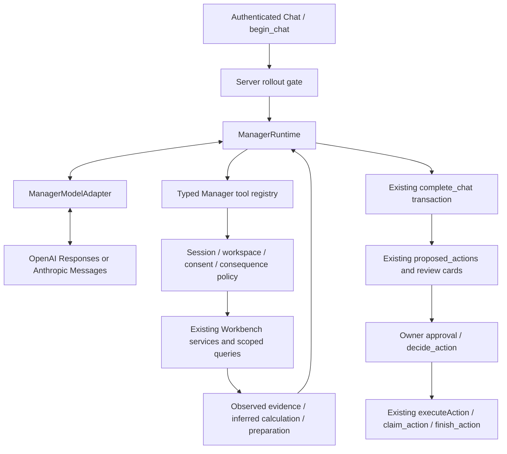

# Workbench Manager runtime

The Manager coordinates Workbench capabilities from Chat. The model occupies a
replaceable role; Workbench owns evidence, skills, access rules, proposals and
execution. Enabled requests pull relevant workspace evidence as needed rather
than depending on a conversation-only action snapshot.



## Provider contract

`ManagerModelAdapter.runTurn(ManagerTurnInput)` returns either typed requested
tool calls or a validated final `ManagerAnswer`. Inputs contain instructions,
bounded conversation, compact identity/authority, tool definitions, governed tool
results, optional neutral image/text attachments, cancellation and output budget.
The runtime does not know Responses `function_call`, Messages `tool_use`, HTTP
endpoints, credentials or provider-specific continuation syntax.

`ResponsesManagerAdapter` uses genuine function calls and `function_call_output`
continuations, `store:false`, strict schemas and the existing hardened
`modelFetch`, `modelHttpError`, bounded JSON reader and safe request-ID handling.
Response items, including encrypted reasoning continuation, remain only in the
adapter instance for this request. They are never saved as telemetry.
`AnthropicManagerAdapter` maps native `tool_use`/`tool_result` through the same
contract. Tool names use dots internally and double underscores on the wire.

Availability/quota/network/timeout fallback can switch once to the other
consented configured provider, then stays there. Refusal, invalid output,
authentication or permission errors do not trigger fallback. Completed tool
results travel to the new adapter as evidence; tools are not replayed. The new
adapter receives its own true runtime identity. PDF bytes remain withheld;
current-message images and text retain the existing authorized attachment path.

## Tool contract and scope

Every entry declares a stable name, description, original Zod input/output,
current-workspace scope, consequence, read-only/reversible flags, required role,
provenance and server executor. Input objects reject unknown fields. Output is
validated in a timestamped evidence envelope and capped at 24,000 characters.
Workspace/user IDs are closure values from the authenticated Chat request, not
tool parameters. Entity lookups use both workspace and entity filters. Database
reads retain the user-scoped client and RLS; credential-table reads use narrow
server-selected metadata only. No database or connector credentials reach the
model.

Each invocation rechecks the current Auth user, owner membership, rollout scope,
active workspace, AI consent and unchanged provider preferences. These checks
also run before each model turn, preventing a continuation after revoked consent.
Connection health checks validate the exact workspace/provider/connection tuple
before using the existing pinned verification service.

| Capability                           | Implementation and bound                                                                                                             |
| ------------------------------------ | ------------------------------------------------------------------------------------------------------------------------------------ |
| `workspace.read_summary`             | Current workspace UUID, explicit business/sandbox type and confirmed business profile                                                |
| `records.search`, `records.get`      | Active workspace records; literal search, 8 results, coverage disclosure, full selected record                                       |
| `actions.list`, `actions.get_status` | Latest 8 matching workspace actions across conversations; durable publication state and safe receipt interpretation                  |
| `diagnosis.run`                      | Same `diagnoseOperation` used by the diagnosis button; same membership/consent checks, metadata sanitisation and 3/minute rate limit |
| `connections.list`                   | Selected identities and stored health; no token reads or implied fresh verification                                                  |
| `connections.health`                 | Existing pinned provider check; may update stored health but does not select/reconnect accounts                                      |
| `calendar.read_availability`         | Existing primary-calendar read; next 14 days, 100 items, explicit truncation/coverage                                                |
| `files.list`, `files.get_metadata`   | Up to 12 ready file metadata entries or one scoped file; no storage path, signed URL or raw PDF output                               |
| `trade_intelligence.read`            | Existing managed pack assignment/allowlist and version/hash                                                                          |
| `skills.read`                        | Existing versioned Finance, Marketing, Social, Maintenance and Website packs                                                         |
| `web.research`                       | Existing operator flag, consented provider path and public-query privacy filter; sources returned                                    |
| `calculate`                          | Bounded arithmetic operands and allowlisted operators; no executable expression                                                      |
| `quotes.prepare`                     | Assigned GreenVac pack → deterministic calculation → existing `draft.save` proposal                                                  |
| `actions.prepare`                    | Existing strict proposal union: draft, owner-supplied record, Facebook post or calendar creation                                     |

The registry deliberately does not expose arbitrary HTTP, SQL, execution, source
editing, approval, credential changes, record deletion or external sending.
Manager answers cannot create support cases through the legacy Chat escalation
path. The answer schema requires `escalation: none`, and the API independently
skips that writer for Manager runs. Recommendations stay in the reply.
Status reconciliation means interpreting existing receipts; it does not clear
uncertain publication markers or manufacture a new execution receipt.

## Consequence policy and durable preparation

`read`, `internal_reversible` and `prepare` execute without a conversational
approval when the declared authority permits them. `external_consequential`
returns owner-approval-required, and `restricted` is denied. The current rollout
is owner-only. Registering a new tool does not bypass this centralized policy.

The existing action contract still requires approval for all four proposal types.
The Manager can calculate and assemble a complete internal draft automatically;
`complete_chat` saves that draft's review artifact as a proposed action. Accept
then creates the business record through the existing execution transaction.
This implementation does not silently change that established draft/record
authority policy. Calendar and Facebook effects always retain binding, approval,
claim, duplicate protection and durable receipts.

Preparations accumulate within the bounded run and are committed atomically with
the final Chat message by the existing transaction. They are not described as
durably saved during an intermediate tool result. If the model reaches its
budget after preparing work, the final truthful partial response still includes
those proposals for atomic persistence. A hard process termination before that
transaction has the existing interrupted-run semantics, not a claimed save.

Quotes use the actual managed Markdown pack as the numerical source. The parser
fails closed if the expected rule format changes. The total is
`max(minimum, labour + travel)`; the draft exposes this formula, labour, travel,
GST inclusion and assumptions. Included named localities and after-hours rules
come from the current GreenVac pack. Unknown material job facts still need the
owner. Quotes are private estimates; nothing sends or commits pricing. Scope
changes use existing variation proposals, never overwrite the original quote.

## Run budgets and attention

Six model turns, twelve total tool calls, one availability fallback, an
85-second Manager deadline, 3,500 output tokens per model attempt, 60,000 input
and 80,000 total model tokens per run, 16,000 input characters per tool call and
24,000 output characters per tool result. Token usage is re-summed after every
model call; once spent, the next call is refused with `MANAGER_TOKEN_LIMIT` and
the run returns a truthful partial answer. Ordinary
tools have 15 seconds; diagnosis has 55 and research 25, always capped by the
remaining run signal. Identical normalized tool requests are rejected after the
first attempt. These are resource limits, not a dollar cap.

The existing 110-second Chat work budget and 120-second total deadline remain.
The Manager's smaller budget leaves time for its metadata checkpoint and atomic
completion. Failures preserve safe trace metadata and return a truthful partial
answer instead of inventing success. No background loops or unattended worker
are introduced.

Conversation history is a bounded recent window (8 messages, 12,000 characters)
rather than a transcript replay; older facts are fetched as evidence. The full
token-economy rule and its implementation map live in `docs/TOKEN-ECONOMY.md`.

The Manager responds with the outcome, recommendation and actual owner decision.
Attention is `contained`, `deferred`, `batched` or `interrupt`, recorded in run
metadata. Exact existing navigation directions are appended for connection
review or Actions; there is no new competing UI or approval surface.

## Provenance and observability

Tools timestamp observed state; calculations are inferred from supplied inputs.
Stored health checks are never promoted to fresh verification. A differing Page
name is evidence for a review recommendation, not proof of contamination. Skills
and managed packs retain the existing version hashes. A tool result remains
evidence and cannot grant authority or redefine system instructions.

Existing `agent_runs.model`, `usage`, `provider_trace`, `agents` and
`skill_versions` are used. Six provider turns plus one fallback and one terminal
Manager metadata entry fit the existing eight-entry trace constraint. Usage is
aggregated by provider (at most two rows); model identities remain on attempts.
The terminal entry records adapter/version, final/partial status, attention,
selected skills, tool names, consequences, allowed/denied/failed outcomes,
approval requirements, timings, safe ancillary diagnosis/research attempts and
an `economy` block (model calls, tool calls, input/output/total/cached tokens,
first-turn context characters, evidence characters per tool, stop reason).
Anthropic requests mark the system prompt and tool list as a cache prefix, and
both adapters record cached input tokens.
No prompt, tool arguments, record/file contents, raw response payloads, reasoning
or credentials are stored in traces. No new schema or permission grant is needed.

## Configuration and rollout

Production evidence checked on 15 September 2026: the latest three completed
`agent_runs` had OpenAI `gpt-6-astra`, HTTP 200 and genuine `req_…` identifiers.
The latest checked run was `d629446b-856f-4509-bac4-acffbfa4f588` at
09:20:40 UTC. No live model configuration or secret key was changed.

Provider order/allowlist remains the workspace's migration-004 preferences.
`OPENAI_API_KEY` and `ANTHROPIC_API_KEY` are credentials, not model selectors.
Manager configuration reads `OPENAI_MODEL` (default `gpt-6-astra`) or
`ANTHROPIC_MODEL`. Optional `MANAGER_MODEL` overrides the eligible primary only;
leave it unset to preserve the existing model source of truth. No new credential
is needed for a model swap. `.env.example` now shows the intended Astra model.

All of these server-side conditions must hold:

```dotenv
MANAGER_ENABLED=true
MANAGER_WORKSPACE_IDS=<explicit comma-separated test workspace UUIDs>
MANAGER_OWNER_IDS=<explicit comma-separated owner Auth UUIDs>
```

The caller must also be the workspace owner with active AI consent. Missing or
false settings retain the existing Chat path. No browser toggle grants access.
Disable `MANAGER_ENABLED` and redeploy to turn off the rollout before launch;
the existing diagnosis button and ordinary Chat remain independent.

## Adding a future provider

Implement `ManagerModelAdapter`, translate its real tool protocol inside that
adapter, and register its factory/configuration with an explicit consent path.
Do not change runtime, tool executors, business rules or action execution. A real
new provider needs the existing privacy preferences/UI and allowlist extended;
configuration alone must not silently authorize data sharing.

The fake `provider: fable`, `model: fable-19` tests inject a second adapter into
the same runtime and real registry. They exercise live-evidence-shaped results,
authority, calculations and metadata persistence without any Fable-specific
business code. Fable is fictional and is not exposed as a live configured option.

## Verification

Run `npm run typecheck`, `npm test`, `npm run lint` and `npm run build`.
`manager-runtime.test.ts`, `manager-tools.test.ts` and the Chat API tests cover
native tool parsing/continuation, Fable swapping, tenant/foreign-ID rejection,
unknown tool/SQL/HTTP denial, invalid schemas, consequence gates, loop/deadline
bounds, consent revocation, fallback, secret-free metadata, existing skills,
shared diagnosis and a calculated GreenVac draft. Existing action execution and
database suites continue to exercise the real approval/claim/receipt boundary.
These deterministic tests prove integration and contracts, not live model quality.

Live acceptance, in an explicitly enabled owner test workspace: ask which Page
is selected; ask why the latest Facebook action failed; ask for a four-hour
weekday Queanbeyan estimate with known access/spoil assumptions. Inspect saved
Manager tool traces and review cards. Do not approve a real external action as
a test. Production release/rollout status is recorded in the PR and completion
report, not inferred from unit-test results.
